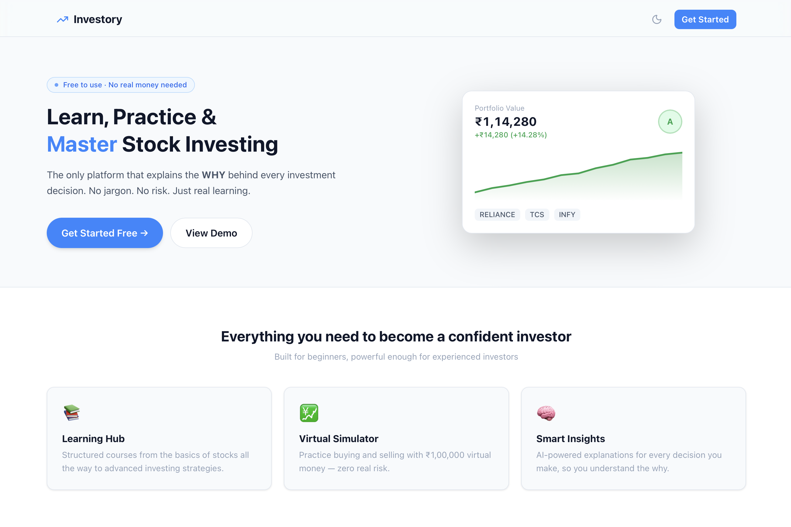
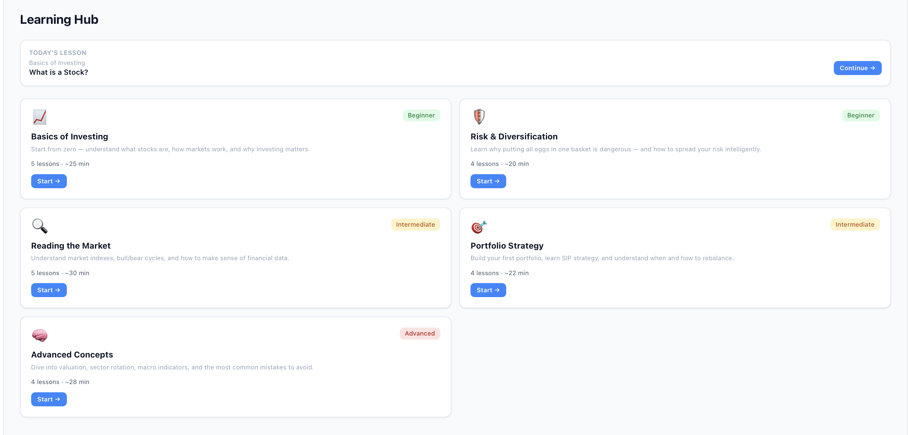
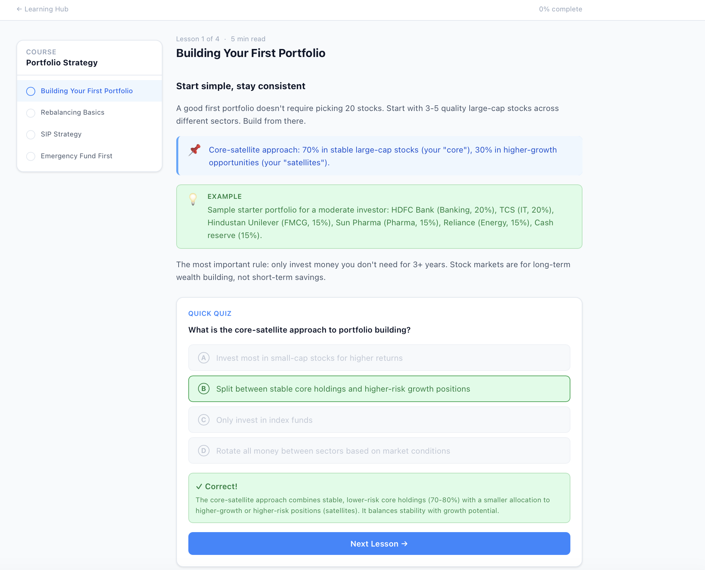
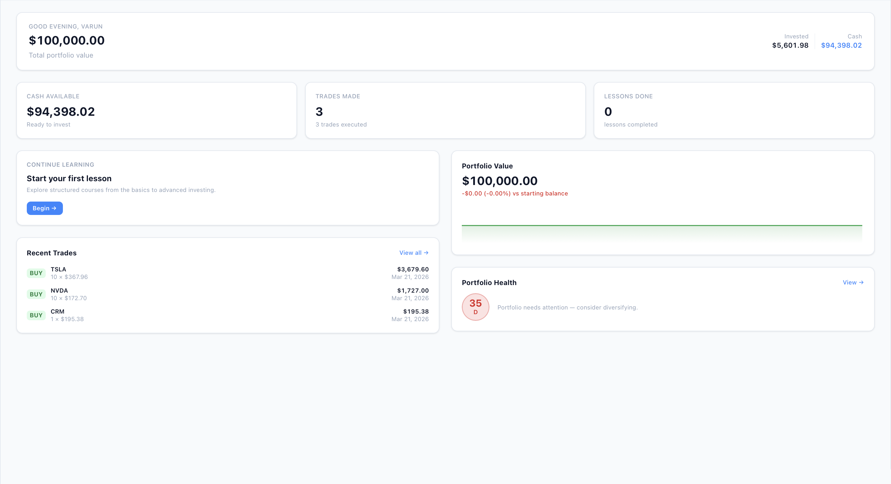
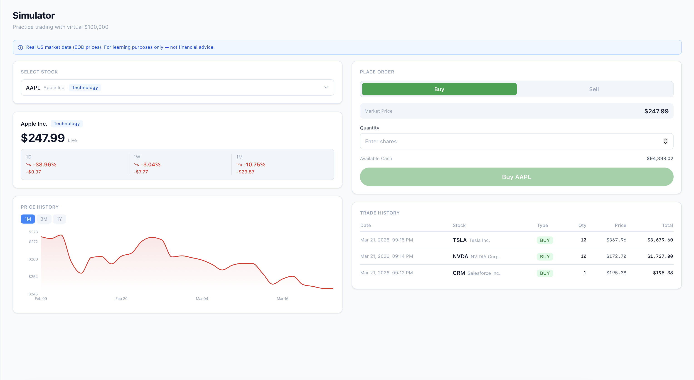
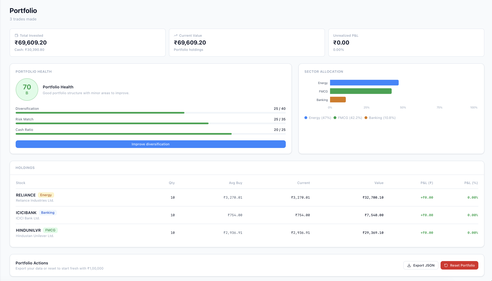
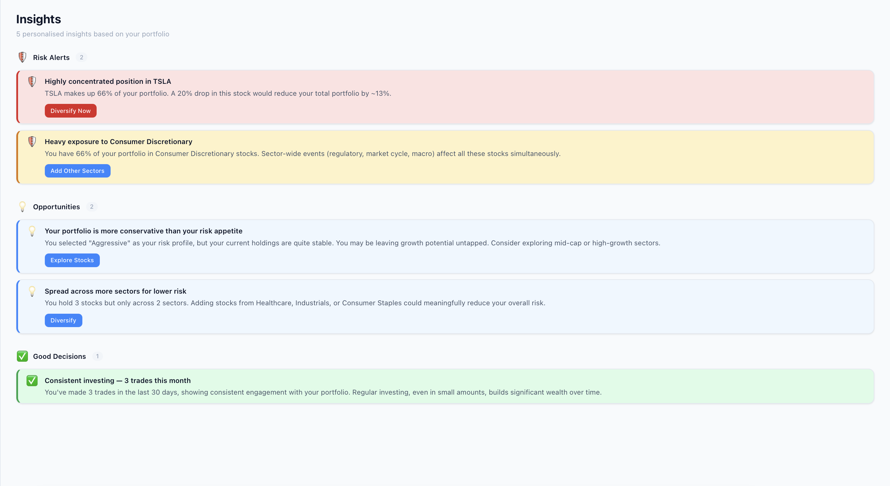
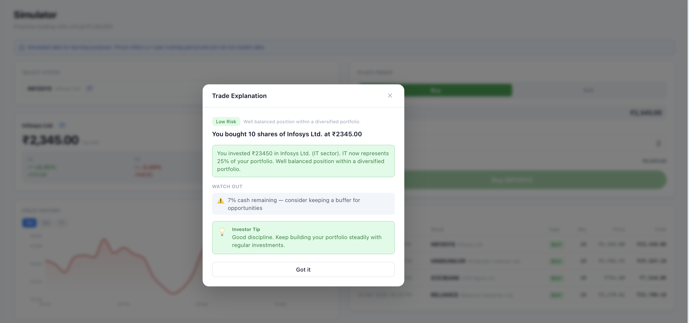

<div align="center">

# 📈 Investory

### Learn. Practice. Invest smarter.

**The only investing platform that explains the *why* behind every decision.**

[](https://nextjs.org)
[](https://www.typescriptlang.org)
[](https://tailwindcss.com)
[](https://zustand-demo.pmnd.rs)
[](./LICENSE)
[](https://investory.vercel.app)

<br />


*The Investory dashboard — portfolio health, daily lessons, and live trade insights in one place.*

</div>

---

## What is Investory?

Most investing apps tell you **what** to do. Investory tells you **why**.

Investory is a free, self-contained platform for learning stock investing from scratch — or sharpening an existing strategy. It combines structured education, a realistic virtual trading simulator, and AI-powered explanations into one cohesive experience.

No real money. No sign-up required. Just learn by doing.

> Built for Indian retail investors with NSE Top 50 stocks, ₹ currency, and India-relevant examples — but the concepts apply everywhere.

---

## Table of Contents

- [Why Investory?](#-why-investory)
- [Features](#-features)
- [Learning Hub — The Core Differentiator](#-learning-hub--the-core-differentiator)
- [Screenshots](#-screenshots)
- [Tech Stack](#-tech-stack)
- [Getting Started](#-getting-started)
- [Project Structure](#-project-structure)
- [Contributing](#-contributing)
- [License](#-license)

---

## Why Investory?

The internet has plenty of investing resources. What's missing is the bridge between **knowing** and **doing** — and understanding *why a decision was right or wrong* after you make it.

| Other simulators | Investory |
|---|---|
| Show you numbers | Explain what those numbers mean |
| Let you trade | Teach you *while* you trade |
| Show P&L | Show P&L + tell you why it happened |
| Generic advice | Personalised to your risk profile |

---

## Features

### 📚 Learning Hub *(core differentiator — see below)*
Structured courses, bite-sized lessons, instant quizzes, and a daily streak to keep you coming back.

### 💹 Virtual Trading Simulator
Start with ₹1,00,000 in virtual money and trade NSE Top 50 stocks in a realistic environment. Every trade is tracked, charted, and explained.

### 🧠 "Explain My Action" — AI-Powered Trade Insights
After **every trade**, a plain-English explanation appears:
- What you just did and why it matters
- Your current risk level (Low / Medium / High)
- Specific warnings (e.g. over-concentration, sector risk)
- A constructive tip for improvement

And before you trade — a **live pre-trade insight** updates as you type your quantity, warning you before you make a mistake.

### 📊 Portfolio Health Score
A 0–100 score that measures the real quality of your portfolio across three dimensions:
- **Diversification** — how well spread across sectors and stocks
- **Risk Match** — whether your holdings match your stated risk tolerance
- **Cash Ratio** — whether you're over-invested or holding too much idle cash

Includes a delta (`+5 after last trade`) and an actionable CTA based on your score.

### 🔍 Diagnostic Insights
Four categories of personalised insights — not random tips:
- **Risk** — concentration warnings, sector exposure
- **Mistakes** — selling at a loss, over-trading patterns
- **Opportunities** — gaps in your strategy based on your risk profile
- **Good Decisions** — positive reinforcement for what you're doing right

### 🛠 Financial Tools
- **SIP Calculator** — project wealth from monthly investments
- **Compound Interest Calculator** — visualise the power of compounding

---

## 📚 Learning Hub — The Core Differentiator

> *"The best investment you can make is in yourself."* — Warren Buffett

Most simulators drop you into a trading interface with zero context. Investory starts with education and connects every lesson directly to practice.

### 5 Courses · 22 Lessons · Instant Feedback

| Course | Level | Lessons |
|---|---|---|
| Basics of Investing | Beginner | What is a stock? How prices move. P/E ratio. |
| Risk & Diversification | Beginner | Risk types. Why diversification works. Sector vs geographic. |
| Reading the Market | Intermediate | NSE/BSE. Bull/bear cycles. NIFTY 50 explained. |
| Portfolio Strategy | Intermediate | Building your first portfolio. SIP. Rebalancing. |
| Advanced Concepts | Advanced | Valuation. Sector rotation. Macro indicators. |

### How it works

**1. Read** — Each lesson is a focused 3–6 minute read with real Indian market examples.

**2. Answer** — Every lesson ends with an instant-feedback quiz. Select an answer, get immediate confirmation and the explanation *why* — even if you got it right.

**3. Do** — Lessons with a practical component include a **"Try it in Simulator"** button that deep-links you to the simulator with contextual hints.

```
"You just learned about diversification.
 Try buying stocks from 2 different sectors in the simulator."
                                         ↓
              /simulator?lesson=diversification
```

**4. Track** — Progress bars per course, completion checkmarks per lesson, and a **daily streak counter** that rewards consistent learning.

> The streak counts calendar days, not lessons — so completing 10 lessons today still counts as 1 day. Come back tomorrow to build your streak.


*The Learning Hub — structured courses with progress tracking and daily streaks.*


*A lesson in progress — content blocks, instant quiz feedback, and a simulator CTA.*

---

## Screenshots

| | |
|---|---|
|  |  |
| **Dashboard** — portfolio overview, health score, daily lesson prompt | **Simulator** — live pre-trade insights, price chart, trade history |
|  |  |
| **Portfolio** — health score breakdown, sector allocation, holdings P&L | **Insights** — diagnostic cards across Risk, Mistakes, Opportunities, Good Decisions |
|  |  |
| **Learning Hub** — 5 courses, progress bars, streak counter | **Explain My Action** — post-trade explanation modal with risk level and tip |

---

## Tech Stack

| Layer | Technology | Why |
|---|---|---|
| Framework | [Next.js 14](https://nextjs.org) (App Router) | File-based routing, server/client split, great DX |
| Language | [TypeScript](https://typescriptlang.org) | Type-safe contracts between stores, engines, and UI |
| Styling | [Tailwind CSS](https://tailwindcss.com) | Utility-first, consistent design tokens, dark mode |
| State | [Zustand](https://zustand-demo.pmnd.rs) + `persist` | Minimal boilerplate, localStorage persistence built-in |
| Charts | [Recharts](https://recharts.org) | Declarative React charts, smooth animations |
| Icons | [Lucide React](https://lucide.dev) | Clean, consistent icon set |
| Theme | [next-themes](https://github.com/pacocoursey/next-themes) | Zero-flicker dark/light mode |

**No backend. No database. No API keys required.**

All data lives in the browser via Zustand + `localStorage`. Stock price history is deterministic (seeded, not random) — so charts look realistic and consistent across sessions.

---

## Getting Started

### Prerequisites

- Node.js 18+
- npm / yarn / pnpm

### Installation

```bash
# Clone the repo
git clone https://github.com/YOUR_USERNAME/investory.git
cd investory

# Install dependencies
npm install

# Start the dev server
npm run dev
```

Open [http://localhost:3000](http://localhost:3000) in your browser.

That's it. No `.env` file. No database setup. No API keys.

### Build for production

```bash
npm run build
npm start
```

### Deploy to Vercel (one command)

```bash
npx vercel --prod
```

---

## Project Structure

```
investory/
├── app/
│   ├── (app)/               # Authenticated app pages (requires onboarding)
│   │   ├── dashboard/       # Main hub
│   │   ├── learn/[slug]/    # Course lessons
│   │   ├── simulator/       # Virtual trading
│   │   ├── portfolio/       # Holdings + health score
│   │   ├── insights/        # Diagnostic insights
│   │   └── tools/           # Calculators
│   ├── onboarding/          # 3-step goal + risk quiz
│   └── page.tsx             # Landing page
│
├── components/
│   ├── ui/                  # Base design system (Button, Card, Badge…)
│   ├── layout/              # Navbar, Sidebar, BottomNav
│   ├── simulator/           # OrderPanel, ExplainMyActionModal…
│   ├── portfolio/           # HealthScoreCard, HoldingsTable…
│   ├── learn/               # CourseCard, QuizBlock, LessonContent…
│   └── insights/            # InsightCard, diagnostic sections
│
├── lib/
│   ├── ai/
│   │   ├── explainAction.ts # "Explain My Action" rule engine
│   │   ├── healthScore.ts   # Portfolio Health Score algorithm
│   │   └── diagnostics.ts   # 4-category insights rules
│   ├── data/
│   │   ├── stocks.ts        # NSE Top 50 + 365-day price history
│   │   └── courses.ts       # 5 courses, 22 lessons, all quiz content
│   └── utils/               # Formatters, calculations, cn()
│
└── store/
    ├── useUserStore.ts       # Onboarding profile, risk tolerance
    ├── usePortfolioStore.ts  # Holdings, trades, health score delta
    └── useProgressStore.ts  # Lesson completion, quiz scores, streak
```

---

## How the "Explain My Action" Engine Works

There's no OpenAI API call here. Every explanation is computed locally via a **rule-based engine** (`lib/ai/explainAction.ts`) that runs in milliseconds:

```
After a trade executes:

1. Compute post-trade portfolio snapshot
2. Run 4 rules in sequence:
   → Single-stock concentration  (>40% = High risk)
   → Sector concentration        (>60% = High, >40% = Medium)
   → Cash ratio                  (<10% remaining = warning)
   → Selling at a loss           (>10% below avg buy price)
3. Final risk = max(all rule outputs)
4. Fill explanation template with real computed values
5. Return: headline, risk level, warnings[], tip
```

This means explanations feel personalised (they contain your actual numbers) but are deterministic, fast, and work completely offline.

The same pattern applies to the **Portfolio Health Score** and **Diagnostic Insights** — pure functions, no external dependencies.

---

## Contributing

Contributions are very welcome! Here's how to get involved:

```bash
# Fork the repo, then:
git clone https://github.com/YOUR_USERNAME/investory.git
cd investory
npm install
npm run dev

# Create a branch
git checkout -b feat/your-feature-name

# Make your changes, then open a PR
```

### Ideas for contribution

- [ ] Add more NSE stocks (Mid-cap, Small-cap)
- [ ] Add more courses (Mutual Funds, ETFs, Options basics)
- [ ] Connect a real market data API (Alpha Vantage, Yahoo Finance)
- [ ] Add portfolio comparison (your portfolio vs NIFTY 50)
- [ ] Mobile app (React Native / Expo)
- [ ] Leaderboard for virtual trading
- [ ] More languages (Hindi, Tamil, Telugu)

### Guidelines

- Keep PRs focused — one feature or fix per PR
- Match the existing TypeScript style (no `any`, explicit interfaces)
- Test in both light and dark mode before opening a PR
- Add an entry to the relevant section in this README if you add a feature

---

## Roadmap

- [x] Virtual trading simulator with ₹1,00,000 starting balance
- [x] "Explain My Action" post-trade insights
- [x] Portfolio Health Score (0–100)
- [x] 5 courses / 22 lessons with instant quiz feedback
- [x] Diagnostic insights (Risk / Mistakes / Opportunities / Good Decisions)
- [x] Daily streak tracking
- [x] Dark / light mode
- [ ] Real market data API integration
- [ ] User accounts + cloud sync
- [ ] Mobile app
- [ ] Leaderboard

---

## License

MIT © [Varun Salian](https://github.com/YOUR_USERNAME)

Free to use, fork, and build on. If Investory helped you learn something, a ⭐ on GitHub goes a long way.

---

<div align="center">

**Built with curiosity and a belief that everyone deserves to understand their money.**

[Live Demo](https://investory.vercel.app) · [Report a Bug](https://github.com/YOUR_USERNAME/investory/issues) · [Request a Feature](https://github.com/YOUR_USERNAME/investory/issues)

</div>
